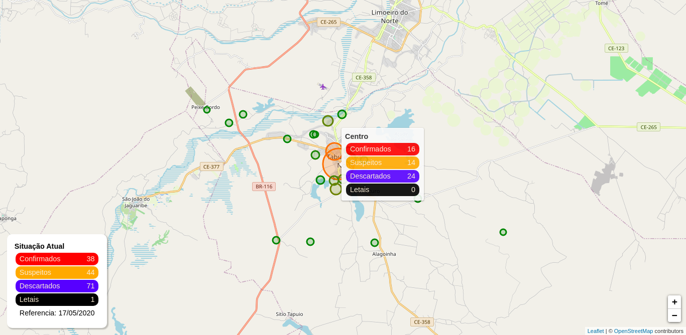

# 🗺 Mapa Covid-19 Tabuleiro do Norte - CE

Uma aplicação para o acompanhamento dos casos de Covid-19 pelas regiões do município de [Tabuleiro do Norte - CE](http://www.tabuleirodonorte.ce.gov.br/) em um mapa. O diámetro e cor dos circulos mostram a intensidade do virús naquela região.

<h1 align="center">
  
</h1>

🔗 Link para testar a aplicação [clique aqui](https://map-covid-19-tab-do-norte.herokuapp.com/).

## 🚀 Funcionamento

Infelizmente, não existe uma forma automatizada de buscar essas informações, como por exemplo usando uma API. A solução que utilizei foi, diariamente, coletar as informações no [Instagram oficial da prefeitura de Tabuleiro do Norte](https://www.instagram.com/prefeituradetabuleirodonorte/) ou com funcionários da administração pública da prefeitura para depois atualizar o repositório.

## :man_technologist: Tecnologias utilizadas

- Framework: [React JS](https://reactjs.org/)
- IDE: [VS Code](https://code.visualstudio.com/)

## 🖥 Dependências

- [Leaflet](https://leafletjs.com/) - biblioteca JavaScript de código aberto para mapas interativos.
- [React-leaflet](https://react-leaflet.js.org/) - fornece uma abstração do Leaflet para componentes do React ⚛️.
- [styled-components](https://styled-components.com/) - biblioteca para React e React Native que permite que você use estilos ao nível de componente 💅.

## Testar

Primeiramente clone o repositório ou faça seu download. Entre na pasta e faça os seguintes comandos:

```bash
// intalando as dependências
npm install

// iniciando o app
npm start

```
